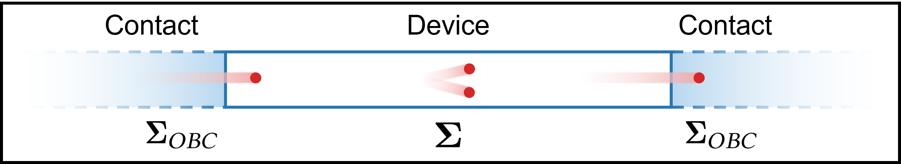
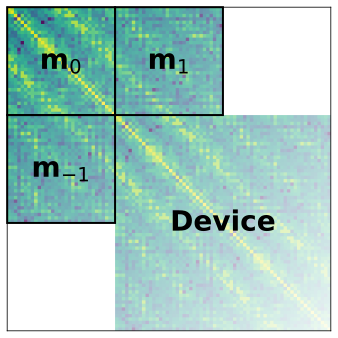

# Open Boundary Conditions

In transport simulations, we are modeling driven quantum systems. This
means that charge carriers are injected into the considered simulation
domain from one *contact*, and they are extracted from the domain at
another *contact*. Since we have to restrict the part of the system that
we model explicitly, these contacts are approximated as semi-infinite
reservoirs in thermal equilibrium that are connected to the simulation
domain and can provide or absorb charge carriers. As long as the
contacts are sufficiently far from the active region of the device, this
is usually a good approximation.

/// caption
Figure 1: Device with semi-infinite contacts where charge carriers are
injected and extracted.
///

In `quatrex`, the electronic structure of the contacts is extracted
directly from the provided Kohn-Sham Hamiltonian and overlap matrix. The
contact matrix elements are selected based on the geometry of the system
and the provided configuration.

/// caption
Figure 2: The left contact blocks of the carbon nanotube system. For
this example, the contacts are simply the left and right most blocks
since the system is created by repeating the wannier centers.
///

Since these open contacts can be understood as "re-normalizing" the
dynamics of the system, they enter the Dyson and Keldysh equations
through the open boundary *self-energies*
$\mathbf{\Sigma}^{R,\lessgtr}_{obc}$.

## Retarded Open Boundary Self-Energy

$$
\begin{equation}
\mathbf{\Sigma}^R = \mathbf{m}_{-1} \mathbf{g}^R
\mathbf{m}_{+1}
\label{eq:retarded_boundary_self_energy}
\end{equation}
$$

$\mathbf{\Sigma}^{R}_{obc}$ can be calculated given the retarded surface Green's function $\mathbf{g}^R$ through Equation $\ref{eq:retarded_boundary_self_energy}$.

$$
\begin{equation}
\mathbf{g}^R = \left[\mathbf{m}_{0} - \mathbf{m}_{-1} \mathbf{g}^R
\mathbf{m}_{+1} \right]^{-1}
\label{eq:obc_recursion}
\end{equation}
$$

To calculate $\mathbf{g}^R$, we need to solve the fixed point problem in
Equation $\ref{eq:obc_recursion}$. This problem can be solved with
different methods, which will be discussed in Section [Solution
Approaches](#solution-approaches). As illustrated in Figure 2,
$\mathbf{m}_{0}$ is the contact block while $\mathbf{m}_{1}$ and
$\mathbf{m}_{-1}$ are coupling blocks from the contact to the device
(see [NEGF](negf.md) and [QTBM](qtbm.md)).

In the case of [QTBM](qtbm.md), the contact blocks $\mathbf{m}_{x} =
E\mathbf{S}_{x} - \mathbf{H}_{x}$ are hermitian: $\mathbf{m}_{0} =
\mathbf{m}_{0}^H$ and $\mathbf{m}_{-1} = \mathbf{m}_{1}^H$. This is not
strictly the case for [NEGF](negf.md) since the blocks can include
scattering. For example, for the electron system the inclusion of
$\mathbf{\Sigma}^R_{GW}$ breaks the symmetry of the contact blocks:
$\mathbf{m}_{x} = E\mathbf{S}_{x} - \mathbf{H}_{x} -
\mathbf{\Sigma}^R(E)$. Further for the Coulomb screening system, the
product $\mathbf{V}\mathbf{P}^R(E)$ breaks the symmetry of the contact
blocks: $\mathbf{m}_{x} = \mathbf{I}_{x} -
\left[\mathbf{V}\mathbf{P}^R(E) \right]_{x}$.

## Lesser/Greater Open Boundary Self-Energy

$$
\begin{align}
\mathbf{\gamma} &= j \left(\mathbf{\Sigma}^R - \left[\mathbf{\Sigma}^R\right]^H \right) \label{eq:lesser_greater_boundary_self_energy1} \\
\mathbf{\Sigma}^{<} &= j \mathbf{\gamma} \left[\frac{1}{1 + e^{\frac{E - E_f - \mu}{k_B T}}} \right] \label{eq:lesser_greater_boundary_self_energy2}\\
\mathbf{\Sigma}^{>} &= j \mathbf{\gamma} \left[\frac{1}{1 + e^{\frac{E - E_f - \mu}{k_B T}}} - 1\right] \label{eq:lesser_greater_boundary_self_energy3}\\
\end{align}
$$

For [NEGF](negf.md), we also need to compute
$\mathbf{\Sigma}^{\lessgtr}_{obc}$. In the case of the electron system,
this is done through the fluctuation-dissipation theorem, resulting in
Equations $\ref{eq:lesser_greater_boundary_self_energy1}$ to
$\ref{eq:lesser_greater_boundary_self_energy3}$. The inputs are
$\mathbf{g}^R$ and the occupancy $\frac{1}{1 + e^{\frac{E - E_f -
\mu}{k_B T}}}$ with the energy $E$, Fermi level $E_f$, chemical
potential $\mu$, Boltzmann constant $k_B$, and temperature $T$.

In the case of the screened Coulomb system, the theorem does not hold,
and a more complex Lyapunov problem $\mathbf{w}^{\lessgtr} =
\mathbf{q}^{\lessgtr} − \mathbf{a}\mathbf{w}^{\lessgtr}\mathbf{a}^{H}$
needs to be solved, which will be discussed in [Lyapunov](lyapunov.md).

## Solution Approaches

One can differentiate between iterative and direct methods to solve the
fixed point problem of Equation $\ref{eq:obc_recursion}$. There exist
general results about fixed points such as
[Banach](https://en.wikipedia.org/wiki/Banach_fixed-point_theorem) and
[Brouwer](https://en.wikipedia.org/wiki/Brouwer_fixed-point_theorem)
theorems, but there are limited results specifically for Equation
$\ref{eq:obc_recursion}$.

!!! info "Algorithm Selection"
    The specific OBC algorithm can be selected through the
    [algorithm](../parameters/obc.md#algorithm) parameter in all
    subsystems [Electron](../parameters/electron.md),
    [CoulombScreening](../parameters/coulomb_screening.md),
    [Phonon](../parameters/phonon.md), and
    [Photon](../parameters/photon.md).

!!! info "QTBM Algorithms"
    For the QTBM, currently only the direct algorithm called `spectral`
    is enabled. This is due to that QTBM anyways need `eigenpairs`
    coming from `spectral` for the calculation of the injection vectors.

### Iterative

Generally, iterative approaches can struggle with convergence, but their
implementation is simpler. The problem is that not all energies converge
the same way, and some energies may not converge at all. This is
especially true for energies close to Van Hove singularities.

#### Fixed-Point Iterations

$$
\begin{equation}
\mathbf{g}^{R,n+1} = \left[\mathbf{m}_{0} - \mathbf{m}_{-1} \mathbf{g}^{R,n+1}
\mathbf{m}_{+1} \right]^{-1}
\label{eq:picard_iterations_g}
\end{equation}
$$

The most straightforward approach is to directly iterate as in Equation
$\ref{eq:picard_iterations_g}$. This scheme convergences (if at all)
linearly with the number of iterations. Due to the slow convergence,
this method is not directly exposed in `quatrex`. Instead the method is
used to refine the solution coming from the `spectral` method. Further,
it is used in the `memoizer` to refine the solution from the previous
iteration.

!!! warning "Forcing Fixed-Point Iterations"
    For testing purposes, it is possible to only do fixed-point
    iterations in NEGF. This is possible be setting the
    [`mode`](../parameters/memoizer.md#mode) parameter of the
    [memoizer](../parameters/memoizer.md) to `force`.

#### Sancho-Rubio

Alternatively to simple fixed-point iteration, the Sancho-Rubio method
is a well developed iteration scheme that accelerates convergence. The
method achieves an exponential convergence rate, but still requires the
problem to be well-posed. To stabilize the method, a small complex value
should be added to the boundary blocks which can be done by setting
[`eta_obc`](../parameters/electron.md#eta_obc) for the electron solver.

The following other parameters affect our implementation:

- [`max_iterations`](../parameters/obc.md#max_iterations)
- [`convergence_tol`](../parameters/obc.md#convergence_tol)

### Direct

#### Spectral Method

$$
\begin{equation}
\sum \limits_{n=-1}^{+1} \lambda^{n} \mathbf{m}_{n} \mathbf{v} = 0
\label{eq:poly_eig}
\end{equation}
$$

It can be showed that the solution of Equation $\ref{eq:obc_recursion}
can be expressed in terms of the eigenpairs of the polynomial eigenvalue
problem in Equation $\ref{eq:poly_eig}$. This `spectral` method is
implemented in `quatrex` and is the recommended default. The method
consists of two main steps:

1. **Eigenvalue Problem**: Solve the polynomial eigenvalue problem with
   any algorithm.
2. **Post-processing**: Filter the eigenpairs and use them to construct
   the surface Green's function.

$$
\begin{equation}
\mathbf{g}^R = \left[\mathbf{m}_{0} - \mathbf{m}_{-1} \mathbf{V} \mathbf{\Lambda}^{-1} \mathbf{V}^{-1}
\right]^{-1}
\label{eq:g_construction}
\end{equation}
$$

The construction of $\mathbf{g}^R$ in terms of the eigenpairs is given
in Equation $\ref{eq:g_construction}$ where $\mathbf{V}$ and
$\mathbf{\Lambda}$ are the matrices of eigenvectors and eigenvalues,
respectively. Only the reflected modes contribute to $\mathbf{g}^R$.
Thus, the filtering step is essential to get a accurate result. The
[NEVP](nevp.md) page elaborates on the possible eigenvalue solver and on
the filtering step. Further details about the method can be found in
[^1].

[^1]: Brück, Sascha. Ab-initio quantum transport simulations for
    nanoelectronic devices. Diss. ETH Zurich, 2017.

### Memoization

Lastly, the [`memoizer`](../parameters/memoizer.md) can be used to
accelerate `NEGF` simulations when there is limited change between
iterations. It works by storing $\mathbf{g}^R$ of the previous SCBA
iteration and trying to refine it with cheap fixed-point iterations. If
the residual after a single fixed-point step is low enough (e.g., below
a certain threshold), the solver call is skipped and a fixed number of
iterations is performed instead. The method can be efficient, but
requires more memory. We plan to compress the stored $\mathbf{g}^R$
guess to reduce the memory footprint.

The above behaviour is when the [`mode`](../parameters/memoizer.md#mode)
parameter is set to `auto` which is the default. The other modes except
`off` should be used with caution, as they may lead to unstable
behaviour. Simulations using `force-after-first`, meaning a single
iteration of a real solver and then always refining, worked, but
resulted in OBC convergence warnings which usually stopped after a few
iterations. It is not studied how these different convergence paths
differ.

!!! info "Memoizer Performance"
    The `memoizer` brings only performance benefits if all MPI ranks
    want to memoize. If selected energies are not memoizing despite a
    stable simulation, then the
    [`agreement_threshold`](../parameters/memoizer.md#agreement_threshold)
    should be lowered.

!!! info "Memoizer Parameters Selection"
    The `memoizer` is both a member of the OBC and the Lyapunov config
    since both are capable of benefiting from memoization. In both, the
    `memoizer` can be separately configured.
